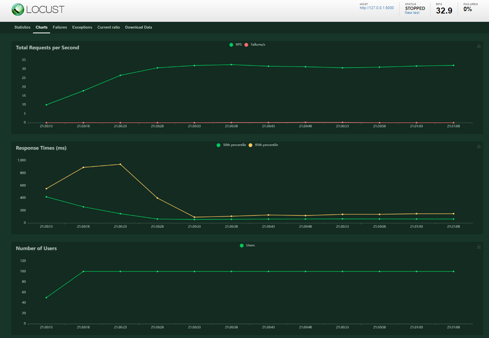

# Тестовое задание на стажировку Avito - Backend
Проект "Banner Service" представляет собой систему управления баннерами, которая позволяет целевым пользователям видеть персонализированный контент на основе их групп принадлежности. Задание - [task.md](task.md)
## Запуск проекта
- Клонирование репозитория
Для начала склонируйте репозиторий:
```sh
git clone https://github.com/UUyy-Geniy/Avito-tech_backend.git
```
- Сборка, запуск контейнеров и применение миграций к вашей базе данных
```sh
make up
make migrate
```
- Создание суперпользователя для доступа к админ-панели Django
```sh
make admin
```
- E2E тестирование
```sh
make test
```
## Используемые технологии
- Django и Django REST Framework для создания REST API.
- Redis как хранилище данных для кэширования и брокер сообщений для Celery.
- Celery для асинхронной обработки задач в фоновом режиме.
- Djoser для реализации системы аутентификации и авторизации пользователей.
- Locust для нагрузочного тестирования
- flake8 в качестве линтера - его конфигурация [Linter Config(flake8).md](Linter%20Config%28flake8%29.md)
## Архитектурные решения
### Паттерн инвалидации кэша
- Для адаптации к возможному значительному увеличению количества тегов и функций в систем. Redis настроен с ограничением памяти в 256 МБ и использует алгоритм удаления наименее часто используемых ключей (LFU), что позволяет увеличивать время ответа на редко запрашиваемые запросы, сохраняя при этом производительность системы.
### Отложенные задачи
- Время отклика при удалении баннеров не должно превышать 100 мс. Решение этой задачи реализовано с использованием Celery, который позволяет управлять выполнением задач асинхронно и в фоновом режиме.

## Графики нагрузочного тестирования 100 пользователей (регистрация + авторизация + запросы баннеров)

